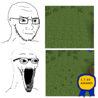
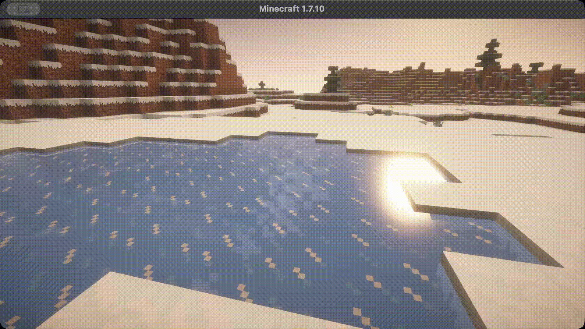
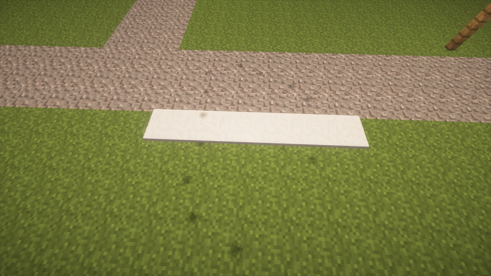

# An Extra Touch

Various small visual, audio, and gameplay tweaks, aimed to enhance the game experience. For Minecraft 1.7.10.

<!--

-->

### Features:
* Entity footprints. Backported from modern Dynamic Surroundings.
* Armor walk and equip sounds. Backported from modern Dynamic Surroundings.
* Cold breath particles. Backported from modern Dynamic Surroundings.
* Water splash sound effects when walking in rain. Backported from modern Dynamic Surroundings.
* Wet entities shed water particles. Backported from Legendary Survival Overhaul.
* Grass trampling. Entities can trample grass when repeatedly walking over it. Entirely server-side, off by default, players only by default.
* Thermal Foundation Blizz snow trail, similar to the Snow Golem.
* Smooth Gui backport.
* Minecraft-CameraOverhaul backport.
* Config system to add camera shakes to sounds.
* Some features backported from modern Shoulder Surfing (meant to be used along the `1.7.10` Shoulder Surfing, but should also work on their own):
  * Decoupled camera
  * Switch to first person when certain items are held, or some actions made (like bow shooting), configurable
  * Player model fading if the camera gets too close
  * Omnidirectional sprinting
* Camera follow lag in Shoulder Surfing mode

The entire mod is heavily configurable.

This mod can be installed on client, server, or both. Armor walking sounds are more precise when the mod is installed on the server.

## Dependencies
* [UniMixins](https://modrinth.com/mod/unimixins)    
* [GTNHLib](https://modrinth.com/mod/gtnhlib)      

## Building

`./gradlew build`.

## Credits
* [Dynamic Surroundings](https://github.com/OreCruncher/DynamicSurroundingsFabric). Armor sound assets and footprint texture come from this mod.
* [LegendarySurvivalOverhaul](https://github.com/Alex-Hashtag/LegendarySurvivalOverhaul).
* [Smooth Gui](https://github.com/Ezzenix/SmoothGui)
* [Minecraft-CameraOverhaul](https://github.com/Mirsario/Minecraft-CameraOverhaul)
* [GT:NH buildscript](https://github.com/GTNewHorizons/ExampleMod1.7.10).

## License

`LgplV3 + SNEED`.

* [Dynamic Surroundings assets and code are licensed under MIT](https://github.com/OreCruncher/DynamicSurroundingsFabric/blob/main/LICENSE).
* [Legendary Survival Overhaul assets and code are licensed under LGPL 2.1](https://github.com/Alex-Hashtag/LegendarySurvivalOverhaul/blob/1.21.1/LICENSE.txt).
* [Smooth Gui code is licensed under CC0-1.0](https://github.com/Ezzenix/SmoothGui/blob/main/LICENSE).
* [Minecraft-CameraOverhaul code is licensed under GPL-3.0](https://github.com/Mirsario/Minecraft-CameraOverhaul/blob/dev/LICENSE.md)

## Buy me some creatine

* [ko-fi.com](ko-fi.com/jackisasubtlejoke)
* Monero: `893tQ56jWt7czBsqAGPq8J5BDnYVCg2tvKpvwTcMY1LS79iDabopdxoUzNLEZtRTH4ewAcKLJ4DM4V41fvrJGHgeKArxwmJ`

 

